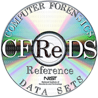

<p align="left">
<a href="#"></a>
</p>

<p align="center">
<a href="#"></a> 
<p align='center' style="font-size:48px; font-family: cursive; "> Dell Hacking Case </p>
</p>

<p align="center">
<a href="https://github.com/Pruthviraj-S"></a>
<a href="#"></a>
<a href="#"></a>
<a href="#"></a>
</p>

# Computer Forensic Reference Data Sets(CFReDS) Case Studies

<p align='center'>

</p>

## Case 1: Dell Hacking Case 

### Scenario:
> On 09/20/04 , a Dell CPi notebook computer, serial # VLQLW, was found             abandoned along with a wireless PCMCIA card and an external homemade 802.11b antennae. It is suspected that this computer was used for hacking purposes, although cannot be tied to a hacking suspect, G=r=e=g S=c=h=a=r=d=t. (The equal signs are just to prevent web crawlers from indexing this name; there are no equal signs in the image files.)  


> Schardt also goes by the online nickname of “Mr. Evil” and some of his associates have said that he would park his vehicle within range of Wireless Access Points (like Starbucks and other T-Mobile Hotspots) where he would then intercept internet traffic, attempting to get credit card numbers, usernames & passwords.


> Find any hacking software, evidence of their use, and any data that might have been generated. Attempt to tie the computer to the suspect, G=r=e=g S=c=h=a=r=d=t.


```yaml
Any names in the forensic image are fictional and do not refer to real people.
```
### Pre-requisites

* [Autopsy](https://www.autopsy.com/download/), a free forensic imager tool.
* [Hacking Case Image](https://cfreds-archive.nist.gov/Hacking_Case.html), from CFREDS archives.
* [FTK](https://www.exterro.com/product-digital-forensics#PD_forensic-toolkit-ftk), paid imaging tool (optional).

### Evidences:

* **What is the image hash? Does the acquisition and verification hash match?**
    ```
    Ans: aee4fcd9301c03b3b054623ca261959a, MD5 Hash matches.

    ⮞ Found in Data Sources-> File Metadata
    ```
    

* **What operating system was used on the computer?**
    ```
    Ans: Windows XP Professsional

    ⮞ Found in Data Source->image file->file metadata
    ⮞ Found in "C:\Boot.ini"
    ```
    
    

* **When was the install date?**
    ```
    Ans: Thursday, August 19, 2004 10:48:27 PM UTC
     
    ⮞ Registry Key: “HKEY_LOCAL_MACHINE\SOFTWARE\Microsoft\Windows NT\CurrentVersion\InstallDate”
    ⮞ Key Path: “C:\Windows\system32\config\Software\Microsoft\Windows NT\CurrentVersion\InstallDate”
    ```
    

* **What is the timezone settings?**
    ```
    Ans: Central Daylight Time
    
    ⮞ Registry Key: “HKEY_LOCAL_MACHINE\system\CurrentControlSet\Control\TimeZoneInformation”
    ⮞ Key Path: “C:\windows\system32\config\system\CurrentControlSet\Control\TimeZoneInformation”
    ```
    

* **Who is the registered owner?**
    ```
    Ans: Greg schardt
    
    ⮞ Registry Key: “HKEY_LOCAL_MACHINE\SOFTWARE\Microsoft\Windows NT\CurrentVersion\RegisteredOwner”
    ⮞ Key Path: “C:\windows\system32\config\software\Microsoft\Windows NT\CurrentVersion\RegisteredOwner”
    ```
    

* **What is the computer account name?**
    ```
    Ans: Mr.Evil w.r.t autopsy, FTK shows N-1A9ODN6ZXK4LQ as computer name.

    ⮞ Path: “C:\windows\system32\config\SAM”
    ⮞ Registry Key: “HKEY_LOCAL_MACHINE\SOFTWARE\Microsoft\Windows NT\CurrentVersion\Winlogon”
    ```
    

* **What is the primary domain name?**
    ```
    Ans: N-1A9ODN6ZXK4LQ w.r.t autopsy, FTK show Mr.Evil

    ⮞ Registry Key: “HKEY_LOCAL_MACHINE\SOFTWARE\Microsoft\Windows NT\CurrentVersion\Winlogon”
    ⮞ Key Path: “C:\windows\system32\config\software\Microsoft\Windows NT\CurrentVersion\Winlogon”
    ```
    

* **When was the last recorded computer shutdown date/time?**
    ```
    Ans: ShutdownTime	REG_BIN	C4 FC 00 07 4D 8C C4 01 , TIME:- 2004-08-27 15:46:33.1092164 Z UTC

    ⮞ Registry Key: “HKEY_LOCAL_MACHINE\SYSTEM\CurrentControlSet\Control\Windows\ShutdownTime”
    ⮞ Key Path: “C:\windows\system32\config\system\CurrentControlSet\Control\Windows\ShutdownTime”
    ⮞ Key Path(2nd method): “C:\WINDOWS\system32\config\software\Microsoft\WindowNT\CurrentVersion\Prefetcher\ExitTime”
    ```
    
     <br>
    `Converter: https://www.digital-detective.net/dcode/`

* **How many accounts are recorded (total number)?**
    ```
    Ans: 5, Administrator, Guest, HelpAssistant, Mr.Evil, SUPPORT_388945a0

    ⮞ Path: “C:\windows\system32\config\SAM”
    ⮞ Can also be found in OS accounts tab in tree view.
    ```
    

* **What is the account name of the user who mostly uses the computer?**
    ```
    Ans: Mr.Evil, 15 logins

    ⮞ Found in OS  accounts tab in tree view.
    ```
    

* **Who was the last user to logon to the computer?**
    ```
    Ans: Mr.Evil

    ⮞ Registry Key: “HKEY_LOCAL_MACHINE\SOFTWARE\Microsoft\Windows NT\CurrentVersion\Winlogon” -> Defaultusername
    ⮞ Key Path: “C:\windows\system32\config\software\Microsoft\Windows NT\CurrentVersion\Winlogon”
    ```
    

* **A search for the name of “G=r=e=g S=c=h=a=r=d=t” reveals multiple hits. One of these proves that G=r=e=g S=c=h=a=r=d=t is Mr. Evil and is also the administrator of this computer. What file is it? What software program does this file relate to?**
    ```
    Ans: irunin.ini, Look@LAN: program to monitor user over lan.
    
    ⮞ We use keyword search to search for the name and get 10 results.
    ⮞ “C:\Program Files\Look@LAN\irunin.ini” contains interesting info.  According to it we can see several entries with name Mr.Evil, LANUSER: Mr.evil and RegOwner: Greg Schardt. Thus both are same users.
    ⮞ ISUSERNTADMIN is set to true which means the user is administrator.
    ```
    
    

* **List the network cards used by this computer**
    ```
    Ans: 2, Xircom CardBus Ethernet 100 + Modem 56 (Ethernet Interface) & Compaq WL110 Wireless LAN PC Card

    ⮞ Registry Key: “HKEY_LOCAL_MACHINE\SOFTWARE\Microsoft\Windows NT\CurrentVersion\NetworkCards”
    ⮞ Key Path: “C:\windows\system32\config\software\Microsoft\Windows NT\CurrentVersion\NetworkCards”
    ```
    
    

* **This same file reports the IP address and MAC address of the computer. What are they?**
    ```
    Ans: Ip: 192.168.1.111, Mac addr: 00:10:a4:93:3e:09

    ⮞ Path: “C:\Program Files\Look@LAN\irunin.ini”
    ```
    

* **An internet search for vendor name/model of NIC cards by MAC address can be used to find out which network interface was used. In the above answer, the first 3 hex characters of the MAC address report the vendor of the card. Which NIC card was used during the installation and set-up for LOOK@LAN?**
    ```
    Ans: Xircom CardBus Ethernet 100 + Modem 56 (Ethernet Interface)

    ⮞ First 3 blocks show vendor info i.e 00:10:a4
    ⮞ Use any ip lookup website to find vendor
    ```
    

* **Find 6 installed programs that may be used for hacking.**
    ```
    ⮞ Go to installed programs in left-tree pane.
    ⮞ We will go thru each of them and search on google and check which can be used for malicioius activity.
    ```
    |       **Software**      |                 **Description**                |
    |:-----------------------:|:----------------------------------------------|
    |         123WASP         | Freeware to get all stored passwords           |
    |        Anonymizer       | Tool used to create a proxy                    |
    | Cain & Abel v2.5 beta45 | password recovery tool for Microsoft Windows   |
    |         Ethereal        | Packet sniffing tool                           |
    |         Look@LAN        | Network monitoring tool                        |
    |       NetStumbler       | wireless networking tool to hack wifi password |

    

* **What is the SMTP email address for Mr. Evil?**
    ```
    Ans: whoknowsme@sbcglobal.net

    ⮞ We do a keyword search for SMTP and look for it in NTUSER.DAT file.
    ⮞ Path:- “C:\Documents and Settings\Mr. Evil\NTUSER.DAT”
    ```
    

* ***What are the NNTP (news server) settings for Mr. Evil?***
    ```
    ⮞ We do a keyword search for NNTP and look for it in NTUSER.DAT file.
    ⮞ Path:- “C:\Documents and Settings\Mr. Evil\NTUSER.DAT”
    ```
    |      **Server Name**      |    **Server username**   |        **Server Password**        |
    |:-------------------------:|:------------------------:|:---------------------------------:|
    | news.dallas.sbcglobal.net | whoknowsme@sbcglobal.net | news.dallas.sbcglobal.netF6E2BA30 |

    

* **What two installed programs show this information?**
    ```
    Ans: Forte Agent and Outlook Express

    ⮞ Multiple mail clients are found in Path :- “C:\windows\system32\config\software\clients\mail”
    ⮞ We do a keyword search for the server Username and find Agent.ini file which belongs to Forte Agent.
    ⮞ Keyword search for NNTP shows NTUSER.DAT which contains info for Outlook Express settings.
    ```
    | **Clients:** | Forte Mail | Hotmail | MSN Explorer | Outlook Express |
    | :-----------: | :-----------: | :-----------: | :-----------: | :-----------: |

    
    

* **List 5 newsgroups that Mr. Evil has subscribed to?**
    ```
    Ans: Alt.binaries.hacking.utilities, Alt.stupidity.hackers.malicious, Free.binaries.hackers.malicious, Free.binaries.hacking.talentless.troll_haven, alt.dss.hack

    ⮞ Keyword search for .dbx files or looking through Outlook Express directory shows files containing newsfeeds.
    ⮞ Path:- C:\Document and Settings\Mr. Evil\Local Settings\Application Data\Identities\{EF086998–1115–4ECD-9B13 9ADC067B4929}\Microsoft\Outlook Express
    ```
    

* **A popular IRC (Internet Relay Chat) program called MIRC was installed.  What are the user settings that was shown when the user was online and in a chat channel?**
    ```
    ⮞ Can be found in ini file inside mIRC directory located at “C:\Program Files\mIRC\mirc.ini”
    ```
    | **User** | **Email** | **nick** | **anic** |
    | :-----: | :-----: | :-----: | :-----: |
    | Mini Me | none@of.ya | Mr | mrevilrulez |

    

* **This IRC program has the capability to log chat sessions. List 3 IRC channels that the user of this computer accessed.**
    ```
    ⮞ We go into mIRC log directiory located at “C:\Program Files\mIRC\logs”. It contains logs of chat sessions.
    ```
    | **Logs** | 1 | 2 | 3 |
    | :-----------: | :-----------: | :-----------: | :-----------: | 
    | **Chat Sessions:** | Chataholics.UnderNet | Elite.Hackers.UnderNet | thedarktower.AfterNET |

    

* **Ethereal, a popular “sniffing” program that can be used to intercept wired and wireless internet packets was also found to be installed. When TCP packets are collected and re-assembled, the default save directory is that users \My Documents directory. What is the name of the file that contains the intercepted data?**
    ```
    Ans: recent.capture_file: C:\Documents and Settings\Mr. Evil\interception
    
    ⮞ We got to following path to look for recents of ethereal. 
    ⮞ Path:- “C:\Documents and Settings\Mr. Evil\Application Data\Ethereal\recent”
    ⮞ We find that recent intercepted data is stored at path “C:\Documents and Settings\Mr. Evil\interception”.
    ```
    

* **Viewing the file in a text format reveals much information about who and what was intercepted. What type of wireless computer was the victim (person who had his internet surfing recorded) using?**
    ```
    ⮞ We find the intercepted data stored at path “C:\Documents and Settings\Mr. Evil\interception”.
    ⮞ Check in text format to find required information.
    ```
    | **Computer** | **Browser** | **Intercept 1** | **Intercept 2** |
    | :-----: | :-----: | :-----: | :-----: |
    | Windows CE (Pocket PC) Version-4.20 | MS internet explorer 4.01 | Mobile.msn.com | MSN Hotmail |

    
    

* **What websites was the victim accessing?**
    ```
    ⮞ We find the intercepted data stored at path “C:\Documents and Settings\Mr. Evil\interception”.
    ⮞ Check in text format to find required information.
    ```
    | **Intercept 1** | **Intercept 2** |
    | :-----: | :-----: |
    | Mobile.msn.com | MSN Hotmail |

    
    

* **Search for the main users web based email address. What is it?**
    ```
    Ans: Yahoo acc: mrevilrulez@yahoo.com
    ⮞ We search through web history tab in left side tree pane but there are 887 entries starting from year 1989. Thus we use timeline to filter the searches to scope of the case i.e 2004.
    ⮞ Filtering timeline using "Limit event types to -> web activity" and  choose detail view mode. This will show us visited urls. We find answer in text section of the files.
    ```
    
    

* **Yahoo mail, a popular web based email service, saves copies of the email under what file name?**
    ```
    Ans: ShowLetter[1].htm	

    ⮞ We go to Keyword hits -> Email address -> req expression -> search for the email we found. 
    ⮞ We find the copies inside one of the showletter.htm files.
    ```
    

* **How many executable files are in the recycle bin?**
    ```
    Ans: 4 P.E files found.
    ⮞ Recycle bin files can be find inside recycler directory. 
    ⮞ Path: “C:\RECYCLER\S-1–5–21–2000478354–688789844–1708537768–1003\”
    ```
    

* **Are these files really deleted?**
    ```
    Ans: No.

    ⮞ When windows deletes files they are just deallocted and removed from allocation table i.e MFT table. but the data still exists in the location untill it is overwritten.
    ⮞ In case of recycle bin, the files are not deallocated instead are just moved to recycler directory.
    ⮞ File status can be seen in file metadata.
    ```
    
    
* **How many files are actually reported to be deleted by the file system?**
    ```
    Ans:
    ```
* **Perform a Anti-Virus check. Are there any viruses on the computer?**
    ```
    Ans:
    ```
<br>

### Refrences

* **CFREDS ARCHIVE FOR DFIS CASES**
    - https://cfreds-archive.nist.gov/

<!-- * **Guide (ONLY SEEE WHEN NEEDED)**
    - https://medium.com/@sshekhar01/cfreds-project-hacking-case-challenge-writeup-6a52883eac0b 
    - https://mountimage.blogspot.com/ -->
## Disclaimer

Contents of this repository are only meant for learning the aspects of computer forensics. Only use for educational purposes
## Contact

<p align='left'><a href='https://discord.com/channels/@me/495023063486824467'></a></p>

<!-- https://gist.github.com/joncardasis/e6494afd538a400722545163eb2e1fa5 , https://simpleicons.org/-->